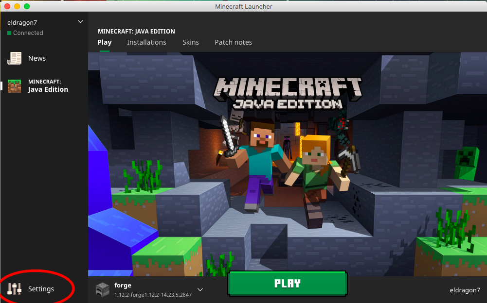
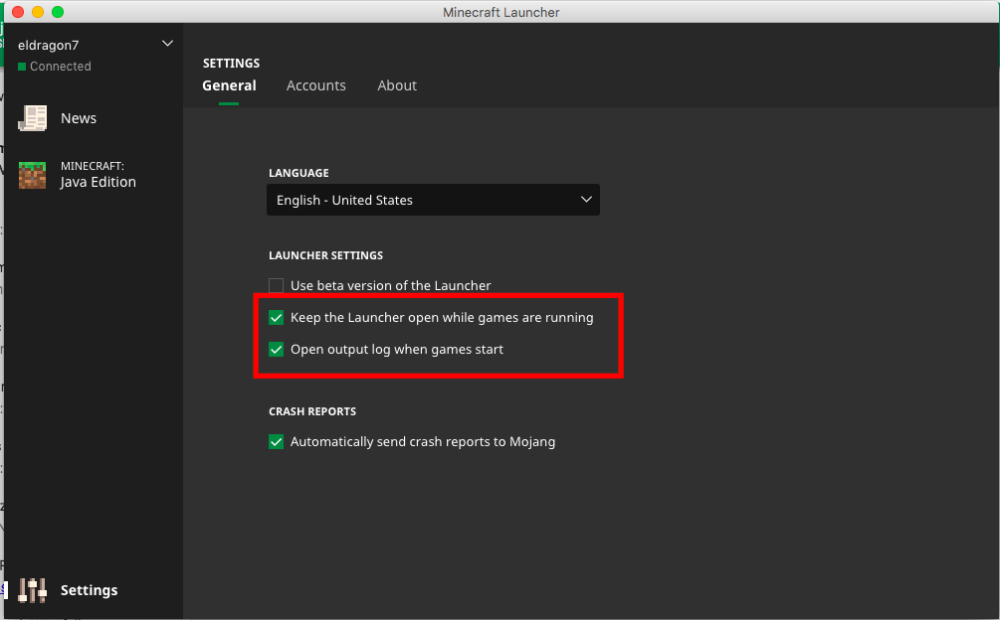
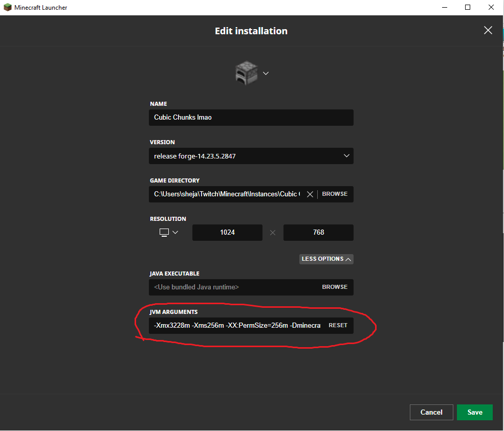

# Troubleshooting

Here is a guide for troubleshooting if you're having problems developing or playing with the mod.

-   [Building](#building)
    -   [Not reaching _BUILD SUCCESSFUL_](#not-reaching-build-successful)
-   [In-game](#in-game)
    -   [Enabling logs](#enabling-logs)
    -   [Location](#location)
    -   [Features like roads or trees not spawning ("download failed ... will not spawn ... javax.net.ssl.SSLHandshakeException: ...")](#features-like-roads-or-trees-not-spawning-download-failed--will-not-spawn--javaxnetsslsslhandshakeexception-)
        -   [Finding JRE on Windows](#finding-jre-on-windows)
        -   [Finding JRE on Mac](#finding-jre-on-mac)
        -   [Switching JRE on Linux](#switching-jre-on-linux)
        -   [Switching JVM certifications on Windows](#switching-jvm-certifications-on-windows)
        -   [Copying cacerts on Mac](#copying-cacerts-on-mac)
    -   ["java.lang.NoSuchFieldError"](#javalangnosuchfielderror)
    -   ["java.lang.OutOfMemoryError: GC overhead limit exceeded"](#javalangoutofmemoryerror-gc-overhead-limit-exceeded)
        -   [JVM Arguments for the client](#jvm-arguments-for-the-client)

## Building

### Not reaching _BUILD SUCCESSFUL_

The most likely cause of this is that the workspace was not setup properly, or the build cache is on automatic garbage collection mode. You can try building the DecompWorkspace (that allows code modification with references to outside libraries), and seeing if that allows the mod to compile:

-   On Windows:

    ```
    gradlew setupDecompWorkspace
    ```

-   On macOS/Linux:

    ```
    ./gradlew setupDecompWorkspace
    ```

Then, try rebuilding:

-   On Windows:

    ```
    gradlew build -g TEST_CACHE_BUILD
    ```

-   On macOS/Linux:

    ```
    ./gradlew build -g TEST_CACHE_BUILD
    ```

## In-game

### Enabling logs

When running the mod, we always recommend to keep your game's log open at all times during game operation. Many times issues occur extremely early, but you won't actually see them in.game until it crashes, or things start to break. Most issues are caught and get printed to the game's log. The new CEFClient-based Minecraft launcher disables the log by default (it also closes itself when clicking Play, which is also unhelpful when problems occur).

To enable the game log, find the launcher settings:



Enable the option **Open output log when games start**:



Keeping the launcher open is also extremely helpful at times, and we recommend you enable that too, although it's not neccessary.

**Remember to scroll down to see the most recent output; the log doesn't automatically scroll.**

### Location

Currently, you will spawn in a square Mushroom Island (or, Null Island). To get anywhere, you will have to teleport with the `/tpll` command.

You can check out the list of some [cool locations](cool_locations.md) to find places to teleport to.

### Features like roads or trees not spawning ("download failed ... will not spawn ... javax.net.ssl.SSLHandshakeException: ...")

This is an issue with older Java versions that do not support the proper SSL certificates to access some of the online databases used by this mod.

This means that you should download the [Java Runtime Enviroment](https://www.java.com/ES/download/) if you don't have it already.

If you already have a JRE you should locate it (see the sections below). Once you've found it, just put that full path to the JRE adding the string `/bin/java` to the end (or `\bin\javaw.exe` if on Windows).

Reopen Minecraft, then create a new world with the Planet Earth generator, you should now have roads.

If this still does not work there is an [alternative method](#switching-jvm-certifications-on-windows).

#### Finding JRE on Windows

On Windows you can tell if you have other JVMs installed by searching "java" using the Windows search:


If you select the **Configure Java** item, your system-wide Java installations will be opened. In this window, click "View" under the "Java" tab:


You will see every major JVM you have installed to your machine. Copy the path up to the `/bin` part (don't include the bin). If you have multiple, choose the newest under **1.8**.

Then, use <kbd>Windows + R</kbd> and paste the path you copied. This will open an Explorer window in this directory.

#### Finding JRE on Mac

Follow the same instructions as for Windows, but instead of searching for "java" on Windows search, look for "java" in your "System Preferences" application:


Once you've found the path, use the <kbd>⌘ + ⇧ + G</kbd> shortcut and paste the path into the box.

#### Switching JRE on Linux

Minecraft on Linux doesn't actually install its own version of JVM like Windows and Mac; it uses whatever your **JAVA_HOME** is set to. You might need to change it to another version if it's not working. The following instructions are written for Ubuntu, but they should work to some degree on all Linux environments.

Running the following command will give you all of your Java installation directories as recognized by the Ubuntu lib installations:

    sudo update-alternatives --list java

Find a version called `java-8`. If you don't have it, use the Java download from above, or run the following command:

    sudo apt-get install openjdk-8-jre-headless

After installing Java 8, run this command:

    sudo update-alternatives --config java

Then select the "selection number" associated with the `java-8` installation.

Your **JAVA_HOME** should move to that version, and use its certificates.

#### Switching JVM certifications on Windows

Travel to the folder you copied. Inside of that folder, find the `/lib/` folder, then `/security/`. Inside of that should exist a file called `cacerts`. If it doesn't exist, try installing another JVM, or using another one installed to your machine.

Once you have confirmed that **cacerts** exists, you need to make Minecraft's JVM use it:

Inside your Minecraft Launcher, go to the "Installations" tab, find your Forge installation, and select "Edit":


Select "More Options", and find the "JVM Arguments" section:



Inside the JVM Arguments add the following line (ensure there is a space before and after):

-   On Windows:

    ```batch
    -Djavax.net.ssl.trustStore="<JVMwithoutBin>\lib\security\cacerts"
    ```

-   On macOS/Linux:

    ```
    -Djavax.net.ssl.trustStore=<JVMwithoutBin>/lib/security/cacerts
    ```

Replace `<JVMwithoutBin>` with your copied path, then click save. Reopen Minecraft, then create a new world with the Planet Earth generator, you should now have roads.

#### Copying cacerts on Mac

Due to file permissions associated with standard Java installations on Mac, only the executable associated with a specific JVM installed can access its own `cacerts` file. However, the user can copy and paste files between locations

Browse into the folder you copied (<kbd>⌘ + ⇧ + G</kbd> and paste the directory), inside of that folder, find the `/lib/` folder, then `/security/`, inside of that should exist a file called `cacerts`, copy (**don't cut**) this file


Then, go to the JVM that's stored in the Minecraft files. The default installation directory is:

    ~/Library/Application Support/minecraft/runtime/jre-x64/jre.bundle/Contents/Home/

Enter the `/lib/security` folder, find your existing `cacerts` file, and rename (**don't delete**) it to something like `cacerts_old`.

Then paste the one you'd copied in. Reopen Minecraft, then create a new world with the Planet Earth generator, you should now have roads.

### "java.lang.NoSuchFieldError"

This error seems to originate with an uncompleted reference build; although Gradle will finish building successfully, Gradle builds with placeholder locations for references to other neccessary code.

A good workaround is to setup the decompiliation cache on your system for Minecraft Forge Gradle, which decompiles Minecraft, Forge, and any extra libraries. Normally, just building should not need this step, unless you are intending to change the code of the mod. To do this, follow the steps in the [first section](#not-reaching-build-successful).

### "java.lang.OutOfMemoryError: GC overhead limit exceeded"

The amount of memory that the JVM has to use was exceeded. You can edit the JVM's memory allocation by changing its arguments. If you're running a server, follow our [instructions](using_server.md) to change this.
